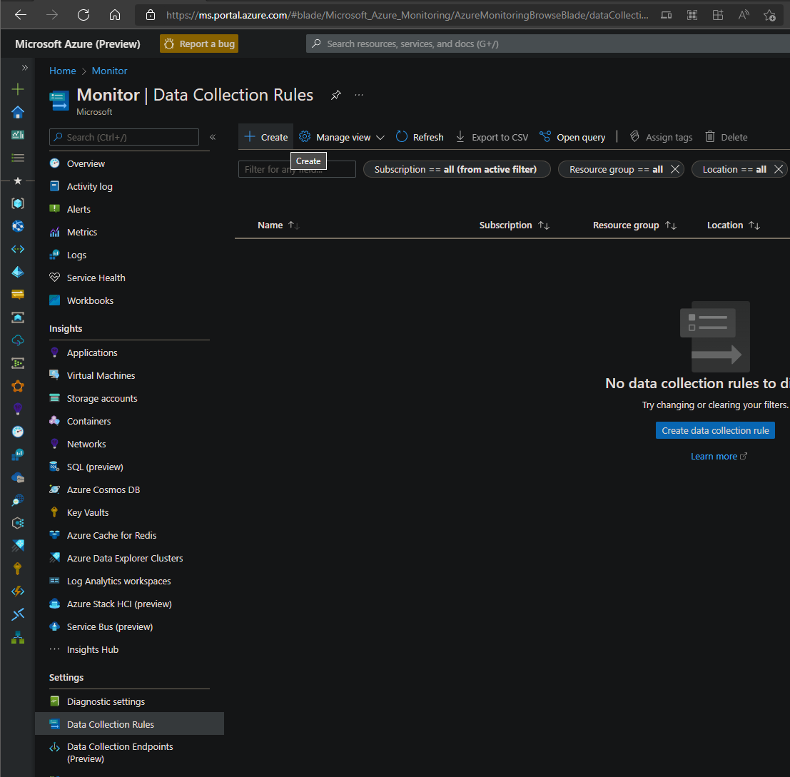

# Standard SKU Service Fabric managed cluster, 2 node type with Azure Monitor enabled

<a href="https://portal.azure.com/#create/Microsoft.Template/uri/https%3A%2F%2Fraw.githubusercontent.com%2FAzure-Samples%2Fservice-fabric-cluster-templates%2Fmaster%2FSF-Managed-Standard-SKU-2-NT-AzureMonitor%2Fazuredeploy.json" target="_blank">
    
</a>
<a href="http://armviz.io/#/?load=https%3A%2F%2Fraw.githubusercontent.com%2FAzure-Samples%2Fservice-fabric-cluster-templates%2Fmaster%2FSF-Managed-Standard-SKU-2-NT-AzureMonitor%2Fazuredeploy.json" target="_blank">
    
</a>

This template allows you to deploy a Service Fabric managed cluster using the *Standard* SKU. This cluster contains two node types running *Windows Server 2022 Datacenter* on a *Standard_D2s_v3* SKU size on Azure Virtual Machine Scale Set with Azure Monitor enabled. Azure Monitor Agent is the new / current logging extension meant to replace other existing extensions. However, Windows Azure Diagnostics (WAD) currently provides the most comprehensive level of monitoring that can cover: events, counters, Event Tracing for Windows (ETW) as well as other information. A WAD template example is located here: [SF-Managed-Standard-SKU-1-NT-WAD](../SF-Managed-Standard-SKU-1-NT-WAD). See [Resources](#resources) for additional information.

## Azure Monitor Data Collection Rules configuration

Configuration of Azure Monitor data collection is centralized and configurable via Azure Portal or PowerShell among other options. To configure using Azure Portal:

**NOTE: This configuration does require the use of System Managed Identity**

1. Navigate to 'Data Collection Rule' in 'Monitor' in Azure portal: https://ms.portal.azure.com/#blade/Microsoft_Azure_Monitoring/AzureMonitoringBrowseBlade/dataCollectionRules

2. Select 'Create' to create a new rule.

    

3. Set 'Rule Name' and 'Resource Group'

    

4. Select the corresponding 'SFC_{{cluster id}}' resource group and node type(s) to monitor

    

5. Select 'Add data source' to add 'Windows event logs' and 'Performance counters'.

    

6. Storing data collected in Log Analytics is not free. To reduce the amount of data collected, use custom logs and XPath for filtering. See [Azure Monitor Pricing](https://azure.microsoft.com/en-us/pricing/details/monitor/). Default filters for Service Fabric clusters:

    ```text
    System!*[System[Provider[@Name='Microsoft Antimalware']]]
    System!*[System[Provider[@Name='NTFS'] and (EventID=55)]]
    System!*[System[Provider[@Name='disk'] and (EventID=7 or EventID=52 or EventID=55)]]
    Application!*[System[(Level=1 or Level=2 or Level=3)]]
    Microsoft-ServiceFabric/Admin!*[System[(Level=1 or Level=2 or Level=3)]]
    Microsoft-ServiceFabric/Audit!*[System[(Level=1 or Level=2 or Level=3)]]
    Microsoft-ServiceFabric/Operational!*[System[(Level=1 or Level=2 or Level=3)]]
    ```

    

7. Select 'Add destination' to add Log Analytics workspace for data destination.

    


8. For Performance Counters, select 'Add data source' and select 'Performance Counters'. Monitoring Service Fabric nodes for performance issues is similar to general server performance troubleshooting. The counters that are autopopulated in the drop downs can be used. 'Basic' as the name suggests, contains minimum performance counter configuration. 'Custom' has more counters covering, cpu, memory, and disk.

    

9. Select appropriate counters and destination for the performance counters and 'Add data source'.

10. With event and counter data sources configured, 'Review and create' the Data Collection Rule.

    

    

11. Once rule is created, data collection should be initiated.

    

## Use Powershell to deploy your cluster

Go through the process of creating the cluster as described in [Deploy a Service Fabric managed cluster](https://docs.microsoft.com/azure/service-fabric/tutorial-managed-cluster-deploy)

## Resources

For more info, see:

- [Service Fabric managed cluster overview](https://docs.microsoft.com/azure/service-fabric/overview-managed-cluster) for details on managed clusters.

- [Service Fabric managed cluster template format](https://docs.microsoft.com/azure/templates/microsoft.servicefabric/2021-05-01/managedclusters) for more details on modifying this ARM template to meet your requirements.

- [Overview of Azure Monitor agents](https://docs.microsoft.com/azure/azure-monitor/agents/agents-overview) for a summary of different monitoring agents available and capabilities.

- [Azure Monitor agent overview](https://docs.microsoft.com/azure/azure-monitor/agents/azure-monitor-agent-overview) for an overview of Azure Monitor Agent.

- [Data Collection Rule overview](https://docs.microsoft.com/azure/azure-monitor/essentials/data-collection-rule-overview)

- [Data Collection Rule configuration](https://docs.microsoft.com/azure/azure-monitor/agents/data-collection-rule-azure-monitor-agent)

- [Limit data collection with custom XPath queries](https://docs.microsoft.com/azure/azure-monitor/agents/data-collection-rule-azure-monitor-agent#limit-data-collection-with-custom-xpath-queries)